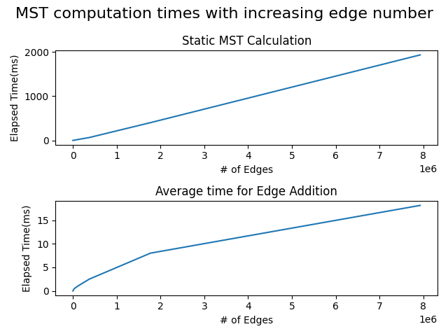

# Minimum Spanning Tree

Minimum spanning tree calculation and dynamic re-calculation by using Kruskal's and
Prim's algorithms

**Implemented by:**

 * [M.Mucahid Benlioglu](https://github.gatech.edu/mbenlioglu3)

## Getting Started

**Prerequisites:**

 - [CMake](https://cmake.org/download/) (version 3.13 or higher)
 - [Make](https://www.gnu.org/software/make) (tested with GNU Make 4.2.1)
 - C++17 compatible compiler (tested with g++ 9.3.0)

_(Should work in Windows as well with either nmake or msbuild combined with cmake,
but it's untested)_

**For Plotting:**

 - [Python 3](https://www.python.org/) (tested with version 3.8.2)
 - [pip](https://pip.pypa.io/en/stable/) (tested with version 20.2.2)

### Installation and Running

There is a Makefile provided for the project. From the project source running running

```shell script
make
```

will create a `build` directory and compile the main executable and test executables.
It will also copy the main executable under project root directory for convenience.
It detects CMake automatically and makes the necessary build calls. This `Makefile`
should be able compile even when CMake is not present.

Alternatively running the following commands will give the same results

```shell script
mkdir build && cd build
cmake ..
make -j
```

### Testing

There are some unit tests included with this project. Running the following
command from the root directory after the project is built will run them show
their outputs.
```shell script
make test
```

Alternatively you can do the following and get the same result
```shell script
cd build
ctest -j
```
 
**Important:**  `Makefile` may not be as comprehensive as the CMake version. It's
highly recommended that you have CMake on your machine before running above commands.

### Plotting Results

A python script is provided to regenerate the plots and from scratch. Running
the following commands from project root will install prerequisites and regenerate
the plots under `results` directory by running the executable with all the datasets
available under `data` directory.

```shell script
pip install -r requirements.txt
python3 results/plotter.py
```

## Algorithm and Discussion

Both Kruskal's and Prim's version is implemented. Although, without using Fibonacci heap,
both have the same complexity of `O(E*log(V))`, Kruskal's run slower in practice due to
a rather inefficient implementation of finding sets within forest, this could be improved
further, however, current implementation doesn't go into details of optimization. If
Fibonacci heap is used with Prim's algorithm it's complexity becomes `O(E+V*log(V))`

**Re-compute MST:**

When a new edge is added to the current MST. This forms _exactly one cycle_ in the
MST. Let `e = (u,v)` be the new edge with the weight `w`. In order to update the
MST we first find the unique path from `u` to `v` in the existing MST. Then we find
the edge with the maximum weight `w*` in this path. If `w < w*` we replace the new
edge with this edge otherwise our MST is already optimal and we make no changes.

Finding the unique path and the maximum of that path takes `O(V)` time, which is
the cost of this operation.



The results in the graphs seems they match the expected results, both dynamic and static
